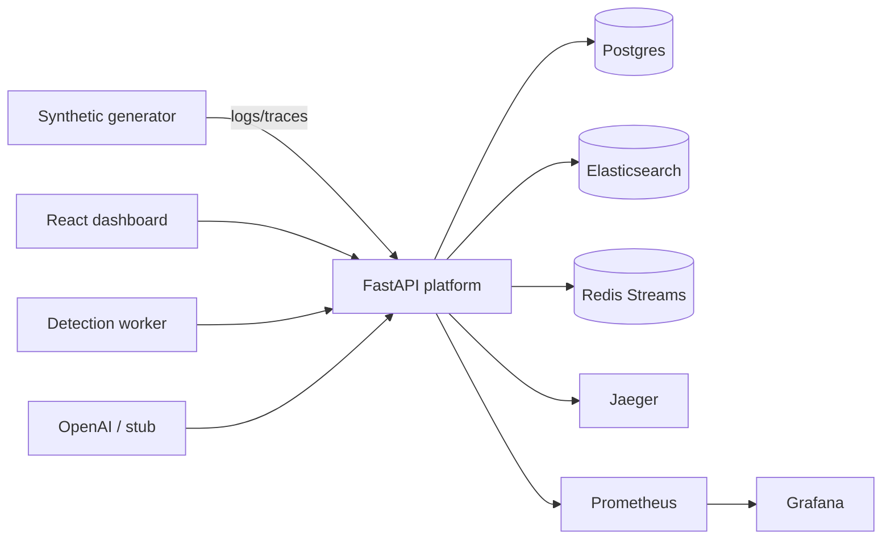

# AI-Augmented API Observability & Auto-Debugging Platform

Centralized platform for collecting and correlating application logs, metrics, and distributed traces. It detects anomalies, opens incidents, and uses an AI-assisted layer to summarize likely root causes and next investigation steps.


## Goals

- Correlate telemetry (logs, metrics, traces) by service, time window, and trace ID
- Detect abnormal behaviour (latency spikes, error rates, failing spans)
- Provide AI-assisted incident summaries and recommended investigation steps
- Expose a unified API and React dashboard for triage

## Tech stack

| Layer | Choice |
|-------|--------|
| Backend | Python 3.12, FastAPI, SQLAlchemy, PostgreSQL |
| Observability | Prometheus, Grafana, Jaeger |
| Logging | Elasticsearch |
| Messaging | Redis Streams |
| AI | OpenAI API (heuristic stub fallback) |
| Frontend | React + TypeScript (Vite) |
| Demo | Synthetic telemetry generator |
| Infra | Docker Compose; Kubernetes manifests under `k8s/` |

## Architecture



Local flow:

1. Generator (or real collectors later) emits logs and traces into the platform APIs.
2. Detection rules scan ES + Jaeger and create deduplicated incidents in Postgres.
3. Operators review incidents in the React dashboard and run AI analysis.
4. Prometheus scrapes `/metrics`; Grafana visualizes API health.

## Getting started

### Prerequisites

- Docker and Docker Compose
- Python 3.12+ (optional local API/generator)
- Node.js 20+ (optional local dashboard)
- `kubectl` + Kind/Minikube (optional Kubernetes path)

### Run with Docker Compose

```bash
cp .env.example .env
# optional: set OPENAI_API_KEY for live LLM analysis
make up
# or: docker compose up --build
```

| Service | URL |
|---------|-----|
| API | http://localhost:8000 |
| API docs | http://localhost:8000/docs |
| Health / Ready | `/health`, `/ready` |
| Prometheus | http://localhost:9090 |
| Grafana | http://localhost:3000 (`admin` / `admin`) |
| Elasticsearch | http://localhost:9200 |
| Redis | `localhost:6379` |
| Jaeger UI | http://localhost:16686 |

### Demo profile (generator + dashboard)

```bash
make up-demo
# or: docker compose --profile demo up --build
```

| Service | URL |
|---------|-----|
| React dashboard | http://localhost:5173 |
| Generator | loops against the API (`payment-timeout` scenario) |

**Suggested demo walkthrough**

1. Wait for `api` to become healthy.
2. Open the dashboard → Services should populate after the first generator burst.
3. Click **Run detection** (or wait for the background loop) → Incidents appear.
4. Open an incident → **Analyze with AI** (stub if no `OPENAI_API_KEY`).
5. Optional: explore Grafana + Jaeger for the same window.

### Useful API routes

- Services / Incidents: `/api/v1/services`, `/api/v1/incidents`
- Analyze: `POST /api/v1/incidents/{id}/analyze`
- Latest analysis: `GET /api/v1/incidents/{id}/analysis`
- Detection: `GET /api/v1/detection/rules`, `POST /api/v1/detection/run`
- Logs / Traces / Correlate: `/api/v1/logs`, `/api/v1/traces`, `/api/v1/correlate/trace/{trace_id}`

Migrations run on API container start (`alembic upgrade head`).

### Local development

```bash
# API
cd backend && python -m venv .venv && source .venv/bin/activate
pip install -e ".[dev]"
alembic upgrade head
uvicorn app.main:app --reload --host 0.0.0.0 --port 8000

# Dashboard
cd frontend && npm install && npm run dev

# Generator
cd generators && pip install -e .
python generate_telemetry.py --api-url http://localhost:8000 --burst 6
```

### Tests & CI

```bash
make test
make test-generator
make build-frontend
```

GitHub Actions (`.github/workflows/ci.yml`) runs backend, generator, and frontend build on push/PR.

### Kubernetes

Starter manifests live in [`k8s/`](k8s/README.md):

```bash
docker build -t observability-api:0.9.0 ./backend
docker build -t observability-frontend:0.9.0 ./frontend
cp k8s/secret.example.yaml k8s/secret.yaml   # edit values
# point kustomization at secret.yaml, then:
kubectl apply -k k8s/
```

## Project layout

```
backend/                 FastAPI app, Alembic, tests
frontend/                React + TypeScript dashboard MVP
generators/              Synthetic payment-timeout emitter
k8s/                     Namespace, ConfigMap, Secret example, deps, API, frontend
prometheus/              Scrape config
grafana/provisioning/    Datasource + dashboards
.github/workflows/       CI
docker-compose.yml
Makefile
.env.example
```

## Configuration

See [`.env.example`](.env.example). Notable knobs:

- Detection thresholds (`DETECTION_*`)
- AI analysis (`OPENAI_API_KEY`, `OPENAI_MODEL`, `AI_ANALYSIS_FORCE_STUB`)
- CORS (`CORS_ORIGINS`) for the dashboard origin
- Demo ports (`FRONTEND_PORT`, generator interval/burst)

## Security notes (local / demo)

- Default Compose credentials are for local demos only — change them before any shared environment.
- API and generator images run as non-root (`uid 10001`).
- Kubernetes secrets are supplied via `secret.example.yaml`; never commit real keys.
- AI analysis falls back to a deterministic stub when no API key is set.

## License

Proprietary — internal / portfolio project.
